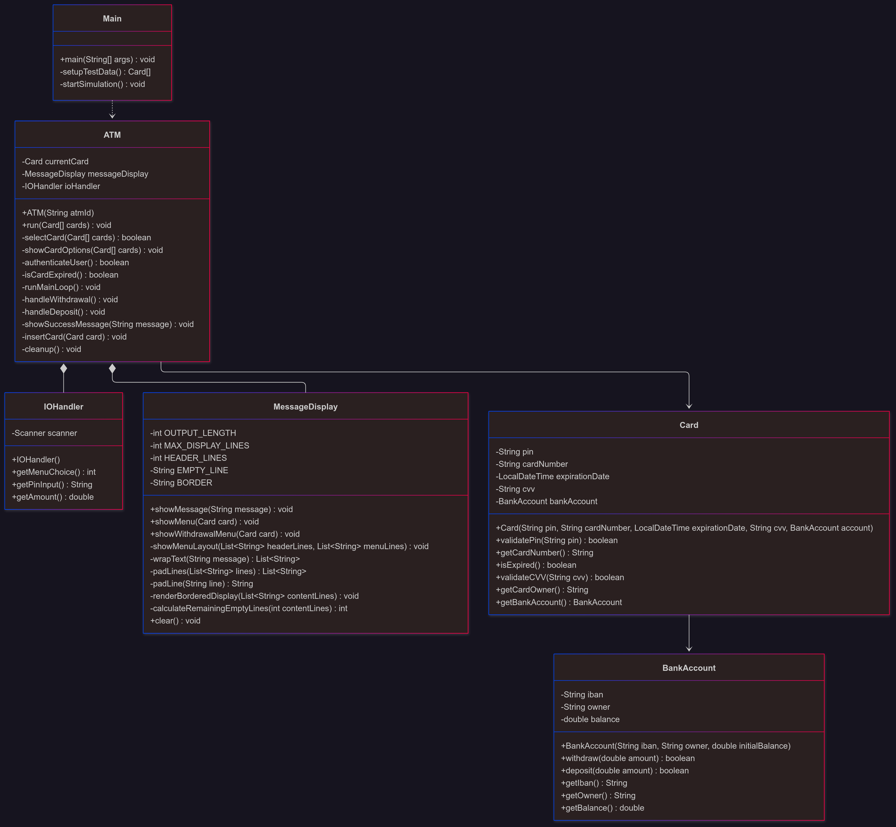

# ATM Simulator

A console-based ATM (Automated Teller Machine) simulator built in Java that demonstrates object-oriented programming principles and clean code practices.

## 🏧 Features

- **Card Selection**: Choose from multiple pre-loaded bank cards with interactive menu
- **PIN Authentication**: Secure 3-attempt PIN verification system with attempt tracking
- **Card Expiration Check**: Automatic validation of card expiration dates
- **Withdrawal Operations**:
    - Quick amounts (CHF 10, 20, 50, 100)
    - Custom amount withdrawal with validation
    - Balance verification and overdraft prevention
    - Transaction cancellation option
- **Deposit Operations**: Add money to your account with amount validation
- **Balance Display**: Real-time balance updates after transactions
- **Error Handling**: Comprehensive input validation and graceful error recovery
- **Clean UI**: Professional bordered console display with consistent formatting
- **Session Management**: Proper card insertion/ejection and session cleanup

## 🚀 Getting Started

### Prerequisites

- Java 11 or higher
- IDE (IntelliJ IDEA, Eclipse, or VS Code)
- Terminal/Command prompt

### Running the Application

1. Clone the repository:
   ```bash
   git clone <repository-url>
   cd atmSimulator
   ```

2. Compile and run:
   ```bash
   javac -d out src/main/java/ch/javamilesiii/*.java
   java -cp out main.java.ch.javamilesiii.Main
   ```

   Or run directly from your IDE by executing the `Main.java` file.

## 🎮 How to Use

1. **Start the application** - You'll see the welcome screen
2. **Insert a card** - Choose from 5 available test cards
3. **Enter PIN** - Each card has a specific PIN (see Test Data section)
4. **Select operation**:
    - `1` - Withdraw money
    - `2` - Deposit money
    - `3` - Eject card and exit
5. **Follow the prompts** for your selected operation

### Example Session

```
######################################################################
#                                                                    #
#    Welcome! Insert your card:                                     #
#                                                                    #
######################################################################
1 - Insert card, 0 - Exit
Choice: 1

######################################################################
#                                                                    #
#    Select your card:                                              #
#                                                                    #
######################################################################
1 - Aubrey Thomas
2 - Layla Roberts
3 - Abigail Peterson
4 - Avery Phillips
5 - Sarah Taylor
Choice: 1

######################################################################
#                                                                    #
#    Enter your PIN:                                                #
#                                                                    #
######################################################################
PIN: 738143

######################################################################
#                                                                    #
#    Hello Aubrey Thomas!                                           #
#    What can I do for you today?                                   #
#                                                                    #
#    Balance: 1000.0 CHF                                            #
#                                                                    #
#                                                                    #
#                                                                    #
#                                                                    #
#                                                                    #
#                                                                    #
#                                                                    #
#                                                                    #
#    1 - Withdraw                                                    #
#    2 - Deposit                                                     #
#    3 - Eject Card                                                  #
#                                                                    #
######################################################################
```

## 🧪 Test Data

The application comes with 5 pre-configured cards:

| Card Owner      | PIN    | Initial Balance |
|----------------|--------|----------------|
| Aubrey Thomas  | 738143 | CHF 1000.0     |
| Layla Roberts  | 612543 | CHF 5100.0     |
| Abigail Peterson | 867826 | CHF 1250.0   |
| Avery Phillips | 874256 | CHF 250.0      |
| Sarah Taylor   | 989631 | CHF 1000.0     |

## 🏗️ Architecture

The project follows **SOLID principles** and demonstrates clean code practices with improved method extraction and separation of concerns:

### UML Class Diagram



### Class Structure

```
src/main/java/ch/javamilesiii/
├── Main.java              # Application entry point and test data setup
├── ATM.java               # Main controller with extracted methods
├── BankAccount.java       # Account data and transaction operations  
├── Card.java              # Card information and validation logic
├── IOHandler.java         # User input handling with error recovery
└── MessageDisplay.java    # Console UI formatting and text wrapping
```

### Design Principles Applied

- **Single Responsibility**: Each class and method has one clear, focused purpose
- **Method Extraction**: Large methods broken down into smaller, testable units
- **Error Handling**: Comprehensive input validation with graceful recovery
- **DRY Principle**: Common functionality extracted into reusable helper methods
- **Encapsulation**: Private helper methods with clear public interfaces
- **Defensive Programming**: Null checks, boundary validation, and safe defaults

### Key Architectural Improvements

- **ATM Controller Refactoring**: Main workflow split into focused methods
    - `selectCard()` - Handles card selection process
    - `authenticateUser()` - Manages PIN verification with attempt limits
    - `runMainLoop()` - Controls main menu and transaction flow
    - `handleWithdrawal()` / `handleDeposit()` - Process specific transaction types

- **Enhanced MessageDisplay**:
    - Text wrapping with multi-line support
    - Consistent bordered layout system
    - Reusable menu layout functionality

- **Robust IOHandler**: Input validation with retry mechanisms
- **Improved BankAccount**: Transaction validation and error messaging

### Relationship Overview

- **Main** creates and configures the ATM system with test data
- **ATM** serves as the central controller, coordinating all operations
- **MessageDisplay** handles all user interface formatting and display
- **IOHandler** manages all user input with validation
- **Card** links to BankAccount and provides secure authentication
- **BankAccount** manages financial data and transaction processing

## 🔧 Key Components

### ATM Class
- **Session Management**: Orchestrates complete ATM workflow from card insertion to ejection
- **Authentication**: Handles secure PIN verification with attempt tracking and lockout
- **Transaction Processing**: Manages withdrawal and deposit operations with validation
- **User Interface**: Coordinates with MessageDisplay for consistent user experience
- **Error Recovery**: Graceful handling of invalid inputs and transaction failures
- **Method Organization**: Well-structured with single-responsibility methods

### BankAccount Class
- **Data Management**: Stores account information (IBAN, owner, balance) securely
- **Transaction Logic**: Handles withdrawal and deposit operations with business rules
- **Validation**: Ensures transaction amounts are valid (positive, within balance)
- **Error Messaging**: Provides clear feedback on transaction failures
- **Balance Protection**: Prevents overdrafts and invalid operations

### Card Class
- **Secure Storage**: Contains card details and expiration information safely
- **Authentication**: Provides PIN validation functionality
- **Expiration Checking**: Validates card is not expired before use
- **Account Linking**: Connects card to associated bank account
- **Data Integrity**: Ensures card information consistency

### MessageDisplay Class
- **Professional UI**: Creates consistent bordered console output with proper spacing
- **Text Processing**: Handles text wrapping for long messages across multiple lines
- **Menu Systems**: Provides reusable menu layouts for different screens
- **Dynamic Content**: Adapts display based on content length and requirements
- **Layout Management**: Maintains consistent formatting across all user interactions

### IOHandler Class
- **Input Management**: Handles all user input with comprehensive error checking
- **Type Safety**: Validates numeric inputs with automatic retry on errors
- **Buffer Management**: Properly cleans input buffers to prevent carry-over issues
- **User Experience**: Provides clear prompts and error messages for invalid input
- **Recovery Mechanisms**: Allows users to retry after input errors

## 🛡️ Security & Error Handling

**Input Security:**
- All user inputs are sanitized and validated before processing
- Buffer clearing prevents input carry-over between operations
- Type checking ensures only valid data types are accepted
- Range validation for monetary amounts and menu choices

**Authentication Security:**
- Maximum 3 PIN attempts with account lockout
- PIN validation without storing plaintext comparisons
- Session timeout and automatic card ejection on failures
- Card expiration date verification before transactions

**Transaction Safety:**
- Overdraft protection with balance verification
- Positive amount validation for all transactions
- Atomic transaction processing (all-or-nothing approach)
- Clear success/failure messaging with balance updates

**Error Recovery:**
- Graceful handling of invalid inputs with retry prompts
- Comprehensive exception catching with user-friendly messages
- Automatic cleanup on session termination or errors
- Consistent error messaging across all operations

**System Robustness:**
- Null pointer protection throughout the application
- Boundary condition checking for all numeric inputs
- Defensive programming practices in all critical operations
- Comprehensive logging of errors for debugging purposes

## 🔜 Potential Enhancements

- [ ] Transaction history logging
- [ ] Different account types (savings, checking)
- [ ] Transfer between accounts
- [ ] Receipt generation
- [ ] Admin mode for card management
- [ ] Configurable withdrawal limits
- [ ] Multi-language support

## 📝 Technical Details

- **Java Version**: 11+
- **Architecture**: Object-oriented with clear separation of concerns
- **UI**: Console-based with formatted output
- **Data Storage**: In-memory (resets on restart)
- **Input Handling**: Scanner-based with comprehensive error recovery

## 📄 License

This project is licensed under the Apache License 2.0 - see the [LICENCE](LICENCE) file for details.

## 🎓 Learning Objectives

This project demonstrates:

**Core Programming Concepts:**
- Object-oriented programming principles and encapsulation
- Method extraction and code organization techniques
- Error handling and defensive programming practices
- Input validation and user experience design

**Software Design Principles:**
- SOLID principles applied in practice
- Single Responsibility Principle through focused classes and methods
- DRY (Don't Repeat Yourself) principle with reusable components
- Separation of concerns in software architecture
- Clean code practices and readable method naming

**Advanced Techniques:**
- Session state management and lifecycle control
- Robust error recovery and graceful degradation
- Text processing and dynamic UI formatting
- Security considerations (PIN attempts, validation)
- Comprehensive testing scenarios with realistic data

**Professional Development:**
- Project documentation and README creation
- Code refactoring and continuous improvement
- Git version control and project organization
- UML diagrams and technical documentation

## 👨‍💻 Author

Created as a learning project to demonstrate Java programming skills and software design principles.

---

*Note: This is a simulation for educational purposes. No real financial transactions are performed.*